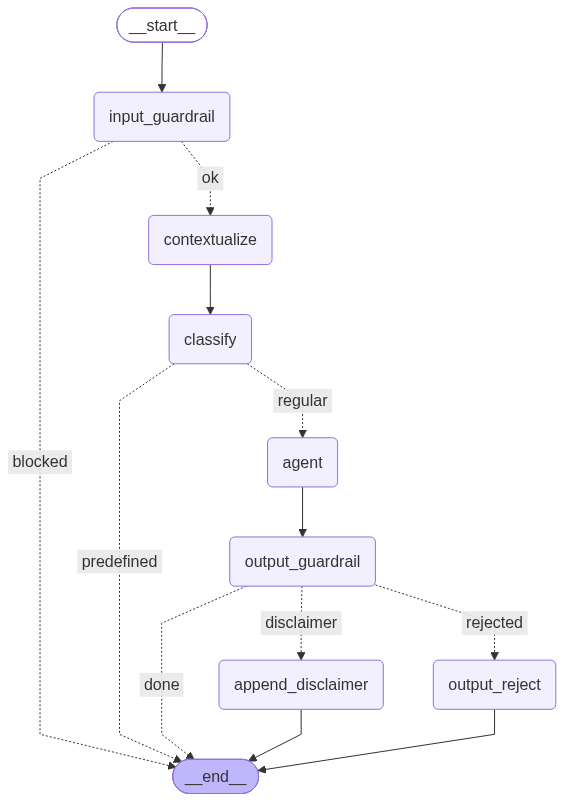

# BDC Assist

Chatbot for NHLBI BioData Catalyst®

## Architecture



- `input_guardrail` yes/no LLM check of the raw message against the policy checklist in
  `data/prompts.yaml` (BDC-related only, no jailbreaks/abuse/etc.); blocked → canned refusal
- `contextualize` rewrites follow-ups into standalone questions using `chat_history`
- `classify` sends flag-r topics straight to a canned response; flag-a topics get a disclaimer appended after the answer
- `agent` calls tools on the doc MCP server (MCP over HTTP)
- `output_guardrail` self-checks the answer against the question; rejected → canned reject
  reply (no disclaimers appended)

All guardrail/classifier checks use the single completion LLM — there is no GUARDIAN_MODEL.

```
bdc_assist/config.py   env-driven get_llm()/get_emb(), same var names as bdc_doc_mcp
bdc_assist/prompts.py  loads data/prompts.yaml, fills dynamic pieces
bdc_assist/graph.py    the LangGraph workflow
bdc_assist/agent.py    deep agent + MCP client (connects to the doc_rag MCP server over HTTP)
bdc_assist/api.py      FastAPI: POST /chat, GET /health
data/prompts.yaml                all prompt texts (editable without touching code)
data/predefined_responses.yaml   topic → {response, flag: r|a}
```

## Setup

```bash
uv sync
cp .env.example .env    # fill OPENAI_API_KEY
```

Use Ollama on Sterling for embeddings (connect via RENCI VPN)
```bash
kubectl -n ner port-forward svc/ollama 11434:11434
```

## Run

```bash
# 1. doc MCP server, port 8001
cd ../bdc-doc-mcp && uv run python -m bdc_doc_mcp.mcp_server --http

# 2. bdc-assist, port 8010
uv run uvicorn bdc_assist.api:app --port 8010
```

`POST /chat` with `{"input": "...", "chat_history": [{"role": "user|assistant", "content": "..."}]}`
returns `{"answer", "blocked", "topics"}`. The server is stateless — the client keeps history.

## Test / demo

```bash
uv run pytest
```

`demo.ipynb` runs every route (regular, follow-up, predefined, disclaimer, blocked) over HTTP
against the running services.

