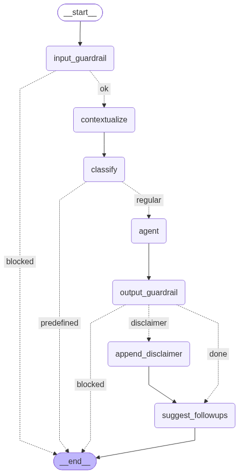

# r-assist

A template for an agentic chat system. An agent answers from your docs and tools over MCP,
and a LangGraph workflow around it keeps its behavior within your policy and guidelines:
input and output guardrails, canned answers and disclaimers for scripted topics, and
follow-up suggestions. Everything project-specific lives in four yaml files under `config/`
(`examples/bdc/` configures it for NHLBI BioData Catalyst, `examples/fastapi/` for the FastAPI docs).

Sibling repos: **r-doc-mcp** (the doc search MCP server) and **r-doc-builder** (builds its content).

## Architecture



- `input_guardrail` yes/no LLM check of the raw message against the policy checklist in
  `config/prompts.yaml` (on-topic only, no jailbreaks/abuse/etc.); blocked → canned refusal
- `contextualize` rewrites follow-ups into standalone questions using `chat_history`
- `classify` sends flag-r topics straight to a canned response; flag-a topics get a disclaimer appended after the answer
- `agent` calls tools on the doc MCP server (MCP over HTTP)
- `output_guardrail` self-checks the answer against the question; a hard block like the input
  guardrail (a "No" or a provider content filter → canned reject reply, `blocked: "output"`, run ends,
  no disclaimers appended)
- `suggest_followups` decides if follow-up questions would help and suggests as many as
  `followups` in `config/project.yaml` (default 3; list of strings in the `followups` response
  field; skipped on refusals/rejects/canned answers)

All guardrail/classifier checks use the single completion LLM.

```
r_assist/config.py   env-driven get_llm(), same var names as r-doc-mcp/r-doc-builder
r_assist/prompts.py  loads config/*.yaml, fills the ${project} placeholders and dynamic pieces
r_assist/graph.py    the LangGraph workflow
r_assist/agent.py    deep agent + MCP client (servers listed in config/mcp_servers.yaml)
r_assist/api.py      FastAPI: POST /chat, POST /chat/stream, GET /health
config/project.yaml              name, short_name, assistant_name — fills the placeholders below
config/prompts.yaml              all prompt texts, a ${placeholder} template (editable without touching code)
config/predefined_responses.yaml topic → {response, flag: r|a, link}
config/mcp_servers.yaml          MCP servers the agent calls (the doc server URL; add a block per extra tool server)
<config dir>/interceptors.py     optional: tool-call interceptors, named per server in mcp_servers.yaml
examples/bdc/                    the four files as used for NHLBI BioData Catalyst, plus interceptors.py (Dug knowledge graphs),
                                 sample_questions.yaml, sample_responses.md (what the API returned for them) and
                                 sample_mcp_responses.md (the raw MCP tool results behind those answers)
examples/fastapi/                the four files for a FastAPI docs bot (the doc server only, no interceptors),
                                 plus sample_questions.yaml
```

## Setup

```bash
uv sync
cp .env.example .env    # fill the completion provider + key
```

Optional: CORS_ORIGINS (comma-separated browser origins, default *) and API_PORT (default 8010, read by the demo scripts and notebook).
Also optional: COMPLETION_TEMPERATURE (default 0), COMPLETION_REASONING_EFFORT (unset for
non-reasoning models like gpt-4o-mini, which reject it; `none`/`low`/`medium`/`high` for reasoning models like
gpt-6-luna; above `none` the temperature is not sent and calls go through the Responses API, the only one where
gpt-6-luna calls tools while reasoning), LOG_LEVEL (default WARNING), MCP_RETRY_SECONDS (default 300: how often
unavailable MCP servers are retried and live ones re-checked), and — for the demo scripts — DOC_MCP_DIR (default ../bdc-doc-mcp) and START_TIMEOUT (default 30 seconds per service).

## Run

Start the model endpoints first; the scripts don't: the embedding endpoint in r-doc-mcp's `.env`
(default local Ollama: `ollama serve`) and the completion endpoint in this `.env` (nothing to start
for hosted OpenAI). Neither is checked at startup — a missing one fails at the first chat.

Everything at once (doc MCP server + r-assist; Ctrl-C stops what it started):

```bash
./demo_services.sh       # Linux / Git Bash
.\demo_services.ps1      # PowerShell (powershell -ExecutionPolicy Bypass -File .\demo_services.ps1 if blocked)
```

Or by hand:

```bash
# 1. doc MCP server, port 8001
cd ../bdc-doc-mcp && uv run python -m r_doc_mcp.mcp_server --http

# 2. r-assist, port API_PORT (default 8010)
uv run uvicorn r_assist.api:app --port "${API_PORT:-8010}"
```

Minimal browser UI for `/chat/stream` (see [API](#api)), rendering the answer and sources as markdown and warning about unavailable MCP servers: open `tests/ui/demo.html` (point it at another server
with `?api=http://host:port`). `tests/ui/kg_demo.html` asks one question and draws the answer's `kg` graphs, a tab per
tool call, coloured by category (hover a node for its details), with the same MCP warning. To try it without any real services:
`uv run python tests/_stub_stream_server.py` serves a fake slow agent on :8011.

## Configure for your project

1. `config/project.yaml`: set `name`, `short_name`, `assistant_name`, and `followups` (how many follow-up questions to suggest);
   `doc_search_tool`/`sources_key` only if your doc server's tool or your client's sources key differ.
2. `config/prompts.yaml`: read through once; the policy checklist and the agent's house rules
   are where projects differ most. Keep the `{input}`/`{answer}`/`{topics}`/`{date}` slots.
3. `config/predefined_responses.yaml`: add canned answers (`flag: r`) and disclaimers (`flag: a`), each with an optional `link`.
4. `config/mcp_servers.yaml`: point `r_doc_mcp.url` at your r-doc-mcp server; add a block for
   every other MCP server the bot may call.
   Optional per server: `interceptors: [fn, ...]` names functions in `interceptors.py` (same
   folder; langchain-mcp-adapters tool interceptors, `async (request, handler)`) that wrap that
   server's tool calls, so a project can reshape a server's results without changing the server
   or r-assist. `examples/bdc` sets `interceptors: [dug_kg]` on `dug_mcp` to turn its rows into
   the `kg` graphs. A name missing from `interceptors.py` fails at startup.
   Optional `stand_ins: [tool, ...]`: while that server is unreachable, each named tool answers with
   an error, so the agent prompt's "if a tool returns an error" rule applies. Without them the
   agent just has fewer tools, and when the prompt names the missing ones it answers from the rest
   (BDC with dug down: release-note study lists presented as catalog results); a system-prompt
   note did not stop that with gpt-4o-mini. List the server's tools your prompt names.
5. Declare the doc types in r-doc-mcp's `config/doc_types.yaml` and list the sources in
   r-doc-builder's `config/sources.yaml`.

Unfilled `${...}` placeholders fail at startup with the offending key. To run the BDC
example as-is: `CONFIG_DIR=examples/bdc` (the FastAPI one: `CONFIG_DIR=examples/fastapi`).

## From clone to chat (the BDC example)

Three sibling repos, each with its own `.env`. Everything project-specific lives in yaml under
each repo's `examples/bdc/`, selected by `CONFIG_DIR=examples/bdc`; leave `CONFIG_DIR` unset and
edit each repo's `config/*.yaml` for your own project.

1. **Prerequisites.** Python 3.12 and [uv](https://docs.astral.sh/uv/), git, an OpenAI-compatible
   completion model (OpenAI, Azure, vLLM or Ollama), and an embedding model served by Ollama:
   `ollama serve` and `ollama pull bge-m3` locally, or a remote Ollama tunnelled to
   `localhost:11434`. The builder and the doc service must use the same embedding model.
2. **Configure.** In each repo `cp .env.example .env`, then fill:
   - `r-doc-builder/.env`: `COMPLETION_*` (the chunk contextualizer), `EMBEDDING_URL`/`EMBEDDING_MODEL`,
     `DOC_MCP_URL=http://127.0.0.1:8000`, `INGEST_TOKEN`, `CONFIG_DIR=examples/bdc`.
   - `r-doc-mcp/.env`: `EMBEDDING_URL`/`EMBEDDING_MODEL` (same as the builder), the same `INGEST_TOKEN`,
     `CONFIG_DIR=examples/bdc`.
   - `r-assist/.env`: `COMPLETION_*` (the bot), `CONFIG_DIR=examples/bdc`.
3. **Start the doc service** (ingest API + HTTP search, port 8000):
   ```bash
   cd r-doc-mcp && uv run uvicorn r_doc_mcp.api:app --port 8000
   ```
4. **Build and push the content** (progress bars per source, file, document and chunk):
   ```bash
   cd r-doc-builder && uv run python -m r_doc_builder.ingest --build --reset
   ```
   With contextualizing this takes about 30 minutes for the BDC sources; `--no-contextualize`
   finishes in about a minute. The build writes `data/bdc/<doc_type>.pkl` (named after `CONFIG_DIR`); to push again without
   rebuilding: `uv run python -m r_doc_builder.ingest data/bdc/ --reset`.
5. **Start the bot.** After the push, so the MCP server opens the finished database:
   ```bash
   cd r-assist && bash demo_services.sh        # PowerShell: .\demo_services.ps1
   ```
   This starts r-doc-mcp's MCP server on `MCP_PORT` (8001) and the r-assist API on `API_PORT`
   (8010), reuses either if already up, and stops what it started on Ctrl-C. The bot connects to
   every server listed in `<CONFIG_DIR>/mcp_servers.yaml` at startup; one that is unreachable is
   logged as a warning and skipped (its `stand_ins` take its place), then retried every
   `MCP_RETRY_SECONDS` until its tools load. One that goes down mid-session is dropped the same way:
   the tool call that hits it hands the agent an error instead of failing the request, and triggers an
   immediate re-check. See `mcp_errors` below.
6. **Chat.** Open `tests/ui/demo.html` in a browser (it talks to `http://localhost:8010`;
   append `?api=http://host:port` for another address), run `demo.ipynb`, or:
   ```bash
   curl -X POST http://localhost:8010/chat -H "Content-Type: application/json" \
        -d '{"input": "How do I cite BDC?", "chat_history": []}'
   ```

**The FastAPI example** runs the same way with `CONFIG_DIR=examples/fastapi` in all three `.env` files;
it needs no server besides r-doc-mcp. Each example keeps its own data, named after the `CONFIG_DIR`
folder (`data/fastapi/` in r-doc-builder, the `fastapi` collection in r-doc-mcp), so switching back
and forth never overwrites the other's; switch by editing the three `.env` files and restarting.

If something is already listening on 8000, 8001 or 8010 (another stack, an old run), stop it
first: `demo_services` would silently reuse it. Re-pushing content while the MCP server is up
requires restarting the MCP server (rerun `demo_services`).

## API

`POST /chat` with `{"input": "...", "chat_history": [{"role": "user|assistant", "content": "..."}]}`
returns `{"answer", "blocked", "topics", "followups", "sources", "sources_md", "kg", "mcp_errors"}`. The server is stateless —
the client keeps history. `sources` is the distinct documents behind the agent's `search_docs` chunks,
`{"r-doc": [{title, link, type}]}`, deduplicated on link and in relevance order (empty for canned,
blocked replies), plus any sources an interceptor attaches to tool results (structured content
`"sources"`, `{key: [{title, link, type}]}`; BDC: the studies Dug cites, under `"dug"`), listed under
their key and deduplicated on link, plus the predefined responses shown (canned answer or disclaimers)
under `"predefined"` (`type: "predefined"`, `title` and `link` from predefined_responses.yaml; title
defaults to the topic, link may be empty; none for blocked replies); `sources_md` is all of them as one
markdown list, worded by `sources`/`sources_item` in prompts.yaml (`sources_item_no_link` for an empty link). `kg` lists the knowledge graphs attached to the agent's
tool results, one per tool call: `[{tool, args, label, nodes: [{id, name, type, category?, description?, attributes?}],
edges: [{subject, object, predicate?}]}]` (empty unless a server or interceptor attaches them, and
for blocked replies). A tool result carries one as its structured content `"kg"`; the LLM never sees it.
A node's `type` is its role, set by the interceptor (BDC: `concept`, `variable`, `study`, or `term` for a
search word standing in for a concept); `category` is the source's own, verbatim, where it gives one;
`attributes` holds other fields worth keeping (BDC: a variable's `related_concepts_count`).
`label` names the graph in the user's terms ("asthma concept graph"), for a UI to show instead of a tool name.
`mcp_errors` lists the MCP servers currently unavailable (re-checked every `MCP_RETRY_SECONDS`), `"name: error"` each (e.g.
`"dug_mcp: HTTPStatusError: Client error '403 Forbidden' ..."`); the agent answers without their tools.

`POST /chat/stream` takes the same body and answers as SSE, one JSON object per event:

- `{"type": "node", "node"}` — a workflow node started (progress)
- `{"type": "status", "text"}` — what the agent is doing (tool calls)
- `{"type": "token", "text"}` — one token of the agent's provisional answer
- `{"type": "reset"}` — new model turn: discard the tokens streamed so far
- `{"type": "sources", sources, sources_md, kg}` — the agent finished; its documentation sources and graphs
  (same values as in `done` unless the answer is blocked, sent early so a UI can show them
  while the guardrail and follow-up steps still run)
- `{"type": "done", answer, blocked, topics, followups, sources, sources_md, kg, mcp_errors}` — final state; the done answer is
  authoritative (an output-guardrail block, disclaimers, canned replies may replace the streamed text;
  `blocked` says which guardrail stopped it: `"input"` (the question was refused) or `"output"` (the
  streamed answer was rejected and replaced), else `null`)
- `{"type": "error"}` — the run failed (an LLM or gateway error mid-answer); the last event, no `done`
  follows, the server log has the details. Discard the streamed text and say so.

`GET /health` returns `{"status": "ok", "mcp_errors"}`, so a UI can warn before the first question.

## Web UI

The web chat client, with the knowledge graph views, lives in its own repository:
[bdc-assist-client](https://github.com/bdc-assist/bdc-assist-client). It talks to this server's
`/chat/stream` (API on :8010 by default; see [API](#api) for the contract it relies on).

To work on it without real services, run the stub (`uv run python tests/_stub_stream_server.py`,
port 8011) and start the client with `VITE_API_URL=http://127.0.0.1:8011`. A keyword in the
question picks a path: `block` (input guardrail refuses), `reject` (output guardrail replaces the
draft), `canned` (predefined reply), `nosources`, `crash` (the stream ends with an error), `kg` or
`kg2` (a real Dug graph for one concept, or for asthma and COPD), `related` (asthma's graph plus
its related concepts); anything else gets a docs answer with a small graph. The client's test
fixtures are made from the Dug results in `tests/fixtures/` (its README says how).

## Test / demo

```bash
uv run pytest                      # graph routes, streaming, prompt template — no services needed
```

`demo.ipynb` runs every route (regular, follow-up, predefined, disclaimer, blocked) over HTTP
against the running services; its questions target `examples/bdc`.
